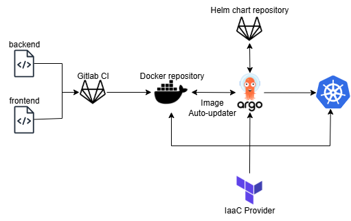

# End to end CI/CD

End to end CI/CD. Key aspects:
- Infrastructure as a Code using Terraform for Kubernetes and related resources creation:
  - Cert-manager setup
  - Ingress Controller setup
  - ArgoCD + image updater + basic application deployment
  - Local Postgres DB deployment
  - Docker Container Registry repositories setup
  - TBD: Observability
- Basic helm chart implementation with Ingress and Image updater configuration
- Environment values

Flow described below:

